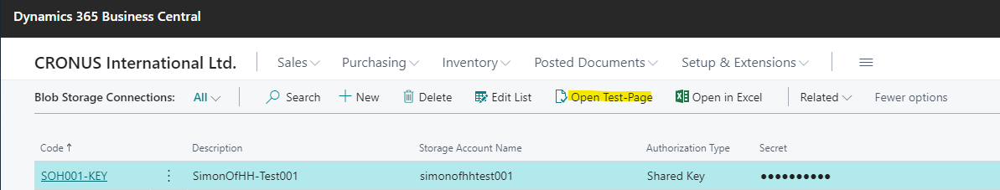
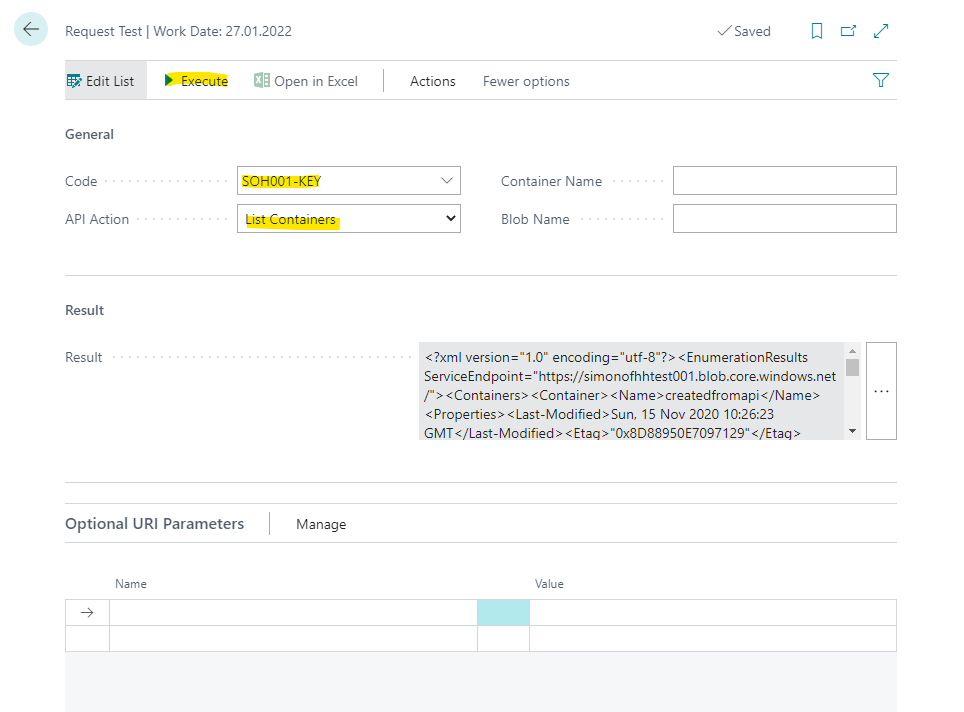

# Azure Blob Storage API

This App reproduces the [Azure Blob Storage REST API](https://docs.microsoft.com/en-us/rest/api/storageservices/blob-service-rest-api) in AL for Microsoft Dynamics 365 Business Central.

**Table of Contents**

1. [Description](#description)
2. [Usage](#usage)
3. [Samples](#samples)
4. [Authorization Methods](#authorization-methods)
5. [API Coverage Status](#api-coverage-Status)
6. [To-Do List](#to-do-list)

## Description

This App reproduces the [Azure Blob Storage REST API](https://docs.microsoft.com/en-us/rest/api/storageservices/blob-service-rest-api) in AL for Microsoft Dynamics 365 Business Central. It comes with some basic UI-functionality, but of course you don't need to use these. Besides the `"AZBSA Blob Storage Connection"` table all tables are temporary.

Contributions are welcome. Feel free to create a Pull Request.

**Please note**: This is a work in progress. I can't guarantee full functionality or no errors. Please report any problems you encounter.

Start by setting up a `Blob Storage Connection`:


From there you have a couple of options, e.g. you can view which containers are available via `List all Containers`


The result might look something like this:


If you want to check what's inside a container you can use one of the other actions:


The result might look something like this:


If you want to download a Blob from this page, just click on `Name` and it will be downloaded.

The other actions work similar, but of course you don't need to use this via UI - you can also just it like in the sample code below.

You can use the "Request Test"-page (alpha version) to view the "raw" HttpResponse for each Request (see it as a "debug"-functionality). To use it, just select "Open Test-Page" from the "Blob Storage Connection"-pages



On this page, just select the Connection you want to use, set the Action and optional parameters and press "Execute"



## Usage

In general you'll mostly need two different objects to work with the API:
- `codeunit 89001 "AZBSA Request Object"`
- `codeunit 89000 "AZBSA Blob Storage API"`

The `codeunit 89001 "AZBSA Request Object"` contains all information relevant for a request. There are multiple overloads for "InitializeRequest", depending on what you need to do. The only parameter relevant for all requests is "Storage Account Name" (and the "Authorization"-information). So before any API-call you need to call `InitializeAuthorization` and `InitializeRequest` and you're ready to go.

All API-methods are publicly available in `codeunit 89000 "AZBSA Blob Storage API"`.

You can also make use of "optional URI parameters" (e.g. "maxresults" for ["List Blobs"](https://docs.microsoft.com/en-us/rest/api/storageservices/list-blobs)). The "Request Object" contains some functions for predefined parameters (SetTimeoutParameter, SetVersionIdParameter, SetSnapshotParameter, SetPrefixParameter, SetDelimiterParameter, SetMaxResultsParameter), but you can also use a "generic" approach with the function "AddOptionalUriParameter(Key, Value)".

## Samples

Check out the procedures in `table 89000 "AZBSA Blob Storage Connection"` to see examples for the usage. Below you can find some more.

### Create Container

```
local procedure CreateContainer(ContainerName: Text)
var
    API: Codeunit "AZBSA Blob Storage API";
    RequestObject: Codeunit "AZBSA Request Object";
    AuthType: Enum "AZBSA Authorization Type";
begin
    RequestObject.InitializeAuthorization(AuthType::SharedKey, '02ruoBoh....jjwgooov49oMA==');
    RequestObject.InitializeRequest('simonofhhtest001', ContainerName);
    API.CreateContainer(RequestObject);
end;
```

### List Blobs

```
local procedure ListBlobs(ContainerName: Text)
var
    API: Codeunit "AZBSA Blob Storage API";
    RequestObject: Codeunit "AZBSA Request Object";
    AuthType: Enum "AZBSA Authorization Type";
begin
    RequestObject.InitializeAuthorization(AuthType::SharedKey, '02ruoBoh....jjwgooov49oMA==');
    RequestObject.InitializeRequest('simonofhhtest001', ContainerName);
    API.ListBlobs(RequestObject);
end;
```

### List Blobs (limit max. results)

```
local procedure ListBlobs(ContainerName: Text)
var
    API: Codeunit "AZBSA Blob Storage API";
    RequestObject: Codeunit "AZBSA Request Object";
    AuthType: Enum "AZBSA Authorization Type";
begin
    RequestObject.InitializeAuthorization(AuthType::SharedKey, '02ruoBoh....jjwgooov49oMA==');
    RequestObject.InitializeRequest('simonofhhtest001', ContainerName);
    // Option 1
    RequestObject.SetMaxResultsParameter(5); // Limits result to a maximum of 5 blobs
    // Option 2
    // RequestObject.AddOptionalUriParameter('maxresults', '5'); // Limits result to a maximum of 5 blobs
    API.ListBlobs(RequestObject);
end;
```

### List Blobs (with Timeout)

```
local procedure ListBlobs(ContainerName: Text)
var
    API: Codeunit "AZBSA Blob Storage API";
    RequestObject: Codeunit "AZBSA Request Object";
    AuthType: Enum "AZBSA Authorization Type";
begin
    RequestObject.InitializeAuthorization(AuthType::SharedKey, '02ruoBoh....jjwgooov49oMA==');
    RequestObject.InitializeRequest('simonofhhtest001', ContainerName);
    // Option 1
    RequestObject.SetTimeoutParameter(2); // Sets timeout to 2 seconds
    // Option 2
    // RequestObject.AddOptionalUriParameter('timeout', '2'); // // Sets timeout to 2 seconds
    API.ListBlobs(RequestObject);
end;
```

## Authorization Methods

Azure supports multiple options to authorize requests (see [here](https://docs.microsoft.com/en-us/rest/api/storageservices/authorize-requests-to-azure-storage)). The App supports the following right now:

Option | Status | Description 
--- | --- | --- 
Shared Key (Storage Account Key) | ✓ | Use one of the keys you can find under "Settings" --> "Access keys" in the Azure portal for your Storage Account (or via [`Get-AzStorageAccountKey`](https://docs.microsoft.com/en-us/powershell/module/az.storage/get-azstorageaccountkey?view=azps-5.0.0))
Shared Access Signature (SAS) | ✓ | Generate a SAS token under "Settings" --> "Shared access signature" in the Azure portal for your Storage Account (or via [`New-AzStorageAccountSASToken`](https://docs.microsoft.com/en-us/powershell/module/az.storage/new-azstorageaccountsastoken?view=azps-5.0.0))
Azure Active Directory (Azure AD) |   | tbd
Active Directory (preview) |   | not planned


## API Coverage Status

The following API-calls are reproduced right now

Operation | Resource Type | Status | Description
--- | --- | --- | ---
[List Containers](https://docs.microsoft.com/en-us/rest/api/storageservices/list-containers2) | Account | ✓ | `procedure ListContainers(var RequestObject: Codeunit "AZBSA Request Object"; [var BlobStorageContainer: Record "AZBSA Container"]; [ShowOutput: Boolean])`
Set Blob Service Properties | Account |  | 
Get Blob Service Properties | Account |  | 
Preflight Blob Request | Account |  | 
Get Blob Service Stats | Account |  | 
Get Account Information | Account |  | 
Get User Delegation Key | Account |  | 
[Create Container](https://docs.microsoft.com/en-us/rest/api/storageservices/create-container) | Container | ✓ | `procedure CreateContainer(var RequestObject: Codeunit "AZBSA Request Object")`
Get Container Properties | Container |  | 
Get Container Metadata | Container |  | 
Set Container Metadata | Container |  | 
Get Container ACL | Container |  | 
Set Container ACL | Container |  | 
Lease Container | Container |  | 
[Delete Container](https://docs.microsoft.com/en-us/rest/api/storageservices/delete-container) | Container | ✓ | `procedure DeleteContainer(var RequestObject: Codeunit "AZBSA Request Object")`
[List Blobs](https://docs.microsoft.com/en-us/rest/api/storageservices/list-blobs) | Container | ✓ | `procedure ListBlobs(var RequestObject: Codeunit "AZBSA Request Object"; [var BlobStorageContent: Record "AZBSA Container Content"]; [ShowOutput: Boolean])`
[Put Blob](https://docs.microsoft.com/en-us/rest/api/storageservices/put-blob) | Block, append, and page blobs | ✓ | `procedure UploadBlobIntoContainerStream(var RequestObject: Codeunit "AZBSA Request Object"; BlobName: Text; var SourceStream: InStream)`
 | | | |  `procedure UploadBlobIntoContainerText(var RequestObject: Codeunit "AZBSA Request Object"; BlobName: Text; var SourceText: Text)`
[Get Blob](https://docs.microsoft.com/en-us/rest/api/storageservices/get-blob) | Block, append, and page blobs | ✓ | `procedure DownloadBlobAsStream(var RequestObject: Codeunit "AZBSA Request Object"; var TargetStream: InStream)`
 | | | |  `procedure DownloadBlobAsText(var RequestObject: Codeunit "AZBSA Request Object"; var TargetText: Text)`
 | | | | Note: Only supports BlockBlob right now
Get Blob Properties | Block, append, and page blobs |  | 
Set Blob Properties | Block, append, and page blobs |  | 
Set Blob Expiry | Block blobs |  | 
Get Blob Metadata | Block, append, and page blobs |  | 
Set Blob Metadata | Block, append, and page blobs |  | 
Get Blob Tags | Block, append, and page blobs |  | 
Set Blob Tags | Block, append, and page blobs |  | 
Find Blobs By Tags | Block, append, and page blobs |  | 
[Delete Blob](https://docs.microsoft.com/en-us/rest/api/storageservices/delete-blob) | Block, append and page blobs | ✓ | `procedure DeleteBlobFromContainerUI(var RequestObject: Codeunit "AZBSA Request Object")`
| | | |  `procedure DeleteBlobFromContainer(var RequestObject: Codeunit "AZBSA Request Object")`
Undelete Blob | Block, append and page blobs |  | 
Lease Blob | Block, append, and page blobs |  | 
Snapshot Blob | Block, append, and page blobs |  | 
Copy Blob | Block, append, and page blobs |  | 
Abort Copy Blob | Block, append, and page blobs |  | 
Put Block | Block blobs only |  | 
Put Block From URL | Block blobs only |  | 
Put Block List | Block blobs only |  | 
Get Block List | Block blobs only |  | 
Query Blob Contents | Block blobs only |  | 
Set Blob Tier | Block and page blobs |  | 
Put Page | Page blobs only |  | 
Get Page Ranges | Page blobs only |  | 
Incremental Copy Blob | Page blobs only |  | 
Append Block | Append blobs only |  | 


## To-Do List

These topics are currently on the to-do list:
- ~~Create "**Request Test**"-page (draft)~~
- ~~Add handling for optional **URI Parameters** (draft)~~
- ~~Add handling for optional **Request Headers** (draft)~~
- Make "**Request Test**"-page more robust
- Extend handling for optional **URI parameters**
- Extend handling for optional **Request Headers**
- Reproduce further API functions
- Create better documentation (Wiki?)